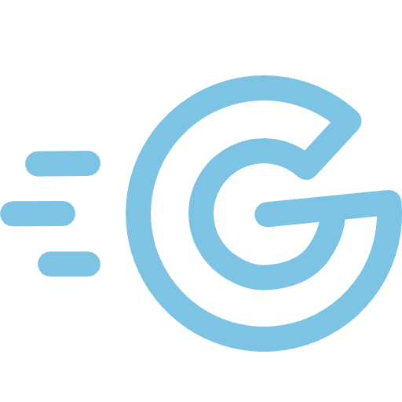
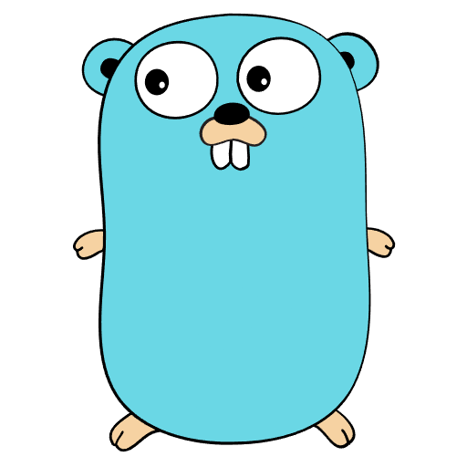

<p align="center">
  
  &nbsp;&nbsp;&nbsp;&nbsp;&nbsp;&nbsp;&nbsp;&nbsp;
  
  &nbsp;&nbsp;&nbsp;&nbsp;
  
</p>

<h1 align="center">Go - El Lenguaje de Programación</h1>

<p align="center">Notas y recursos para aprender desarrollo con Go desde cero hasta nivel avanzado</p>

---

## 📋 Requisitos Previos

### Go

> [!IMPORTANT]
> Asegúrate de tener instalado Go en tu sistema. Puedes descargarlo desde [go.dev](https://go.dev/dl/)

Para verificar que tienes Go instalado:

```bash
go version
```

### Git

> [!NOTE]
> Configura Git con tu información personal antes de comenzar:

```bash
git config --global user.name "Tu nombre"
git config --global user.email "Tu correo"
```

---

## 🚀 Configuración del Entorno

### Variables de Entorno

Go utiliza algunas variables de entorno importantes:

```bash
# Ver configuración actual de Go
go env

# Variables importantes
go env GOPATH
go env GOROOT
go env GOPROXY
```

### Inicializar un Módulo

Para crear un nuevo proyecto con Go Modules:

```bash
go mod init nombre-del-modulo
```

---

## 📚 Recursos de Aprendizaje

### Documentación Oficial

> [!TIP]
> Consulta la documentación oficial de Go para referencias y guías:
>
> **[📄 Go Documentation](https://go.dev/doc/)**
>
> **[📄 Effective Go](https://go.dev/doc/effective_go)**
>
> **[📄 Go by Example](https://gobyexample.com/)**

---

## 🎨 Extensiones Recomendadas para tu Editor

### Extensiones Esenciales

Para mejorar tu experiencia de desarrollo, se recomienda instalar las siguientes extensiones:

| Extensión            | Descripción                         | Link                                                                                       |
| -------------------- | ----------------------------------- | ------------------------------------------------------------------------------------------ |
| **Go**               | Soporte oficial de Go para VSCode   | [Instalar](https://marketplace.visualstudio.com/items?itemName=golang.Go)                  |
| **Go Test Explorer** | Explorador visual para tests de Go  | [Instalar](https://marketplace.visualstudio.com/items?itemName=premparihar.gotestexplorer) |
| **Error Lens**       | Muestra errores inline en el código | [Instalar](https://marketplace.visualstudio.com/items?itemName=usernamehw.errorlens)       |

---

## 🎯 Configuración de Iconos Catppuccin

### Asociaciones de Archivos Go

> [!IMPORTANT]
> Para tener los iconos correctos asociados a los archivos de Go, agrega esta configuración a tu editor:

**Para VSCode**, agrega esto en tu `settings.json`:

```json
{
  "catppuccin-icons.associations.extensions": {
    "go": "go",
    "mod": "go-mod",
    "sum": "go-mod",
    "tmpl": "go"
  }
}
```

> [!NOTE]
> Esta configuración requiere tener instalada la extensión [Catppuccin Icons](https://marketplace.visualstudio.com/items?itemName=Catppuccin.catppuccin-vsc-icons)

---

## 🛠️ Comandos Útiles de Go

### Comandos Básicos

```bash
# Ejecutar un programa
go run main.go

# Compilar un binario
go build

# Formatear código
go fmt ./...

# Ejecutar tests
go test ./...

# Descargar dependencias
go mod tidy

# Ver documentación de un paquete
go doc fmt
```

---

## 📖 Sobre este Repositorio

Este repositorio contiene mis notas y prácticas de aprendizaje sobre:

- ✅ Fundamentos de Go
- ✅ Tipos de datos y estructuras
- ✅ Funciones y métodos
- ✅ Interfaces y composición
- ✅ Concurrencia (goroutines y channels)
- ✅ Manejo de errores
- ✅ Testing en Go
- ✅ Buenas prácticas y patrones

> [!NOTE]
> Repositorio personal de aprendizaje y referencia

---

<p align="center"><i>"La simplicidad es el prerrequisito para la fiabilidad"</i> — Edsger Dijkstra</p>
